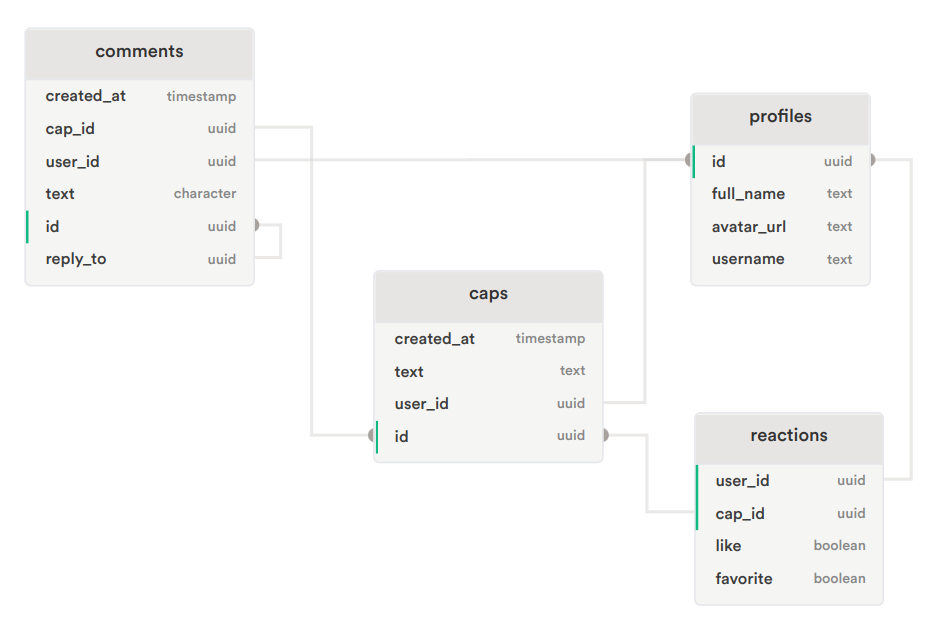

# DatsCap

Twitter-like web app, built w/ React, Tailwind and Supabase

## Table of contents

- [Tech Stack](#-tech-stack)
- [Tools / Dependencies](#-tools--dependencies)
- [Installation](#-installation)
- [Supabase Setup](#-supabase-setup)
- [Environment Variables](#-environment-variables)
- [Run locally](#-run-locally)
- [Build for production](#%EF%B8%8F-build-for-production)

## 🧑🏻‍💻 Tech Stack

**Client:** [React](https://es.reactjs.org/), [TailwindCSS](https://tailwindcss.com/)

**Server:** [Supabase](https://supabase.com/)

## 🔧 Tools / Dependencies

**Bundler:** [Vite](https://vitejs.dev/)

**Routing:** [React Router](https://reactrouter.com/)

**Server state management:** [TanStack Query](https://tanstack.com/query/v4/)

**Linting:** [ESLint](https://eslint.org/)

**Integration with Supabase:** [Supabase-js](https://github.com/supabase/supabase-js)

## 🚀 Installation

```bash
git clone https://github.com/marioperezhurtado/DatsCap.git
cd DatsCap
npm install
```

## ⚡ Supabase Setup

https://supabase.com/docs

- Create an account on Supabase

- Create a new project in the Supabase dashboard

- Click on SQL in the left menu, and execute the following SQL query:

```sql
create table profiles (
  id uuid default uuid_generate_v4() primary key,
  full_name text,
  avatar_url text,
  username text
);

create table caps (
  created_at timestamp default now() not null,
  text text not null,
  user_id uuid references profiles (id) on delete cascade,
  id uuid default uuid_generate_v4() primary key
);

create table comments (
  created_at timestamp default now(),
  cap_id uuid references caps (id) on delete cascade,
  user_id uuid references profiles (id) on delete cascade,
  text character not null,
  id uuid default uuid_generate_v4() primary key,
  reply_to uuid references comments (id) on delete cascade
);

create table reactions (
  user_id uuid references profiles (id) primary key on delete cascade,
  cap_id uuid references caps (id) primary key on delete cascade,
  reaction boolean
  favorite boolean
);
```

Resulting database schema: (Generated w/ [supabase-schema](https://github.com/zernonia/supabase-schema) )



- Enable and configure authentication providers (google, github, discord)
  https://app.supabase.com/project/^your-proyect^/auth/providers

- Create RLS (Row Level Security) authorization rules  
   https://app.supabase.com/project/^your-proyect^/auth/policies

## 💬 Environment Variables

To run this project, you will need to add the following environment variables to your .env file

`VITE_APP_SUPABASE_URL='your-supabase-url'`

`VITE_APP_SUPABASE_ANON_KEY='your-anon-key'`

Both can be found in https://app.supabase.com/project/^your-proyect^/settings/api

## 💻 Run locally

```bash
  npm run dev
```

## 🛠️ Build for production

```bash
  npm run build
```
